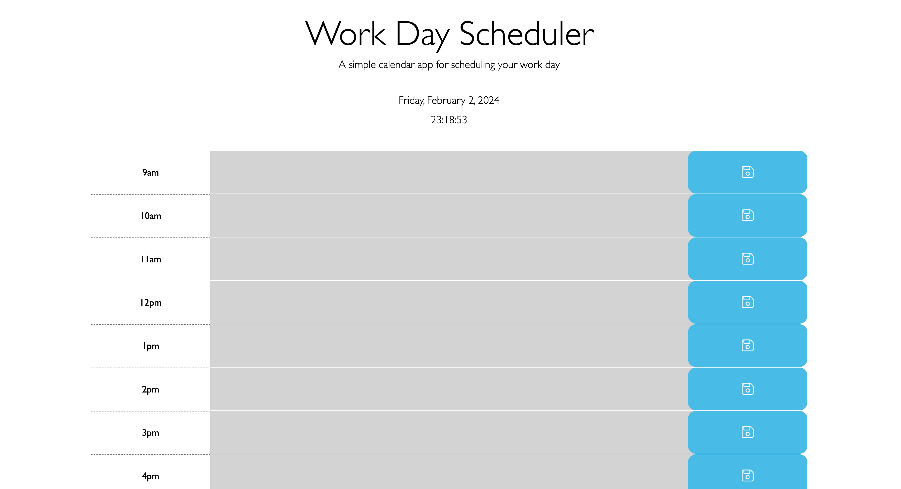
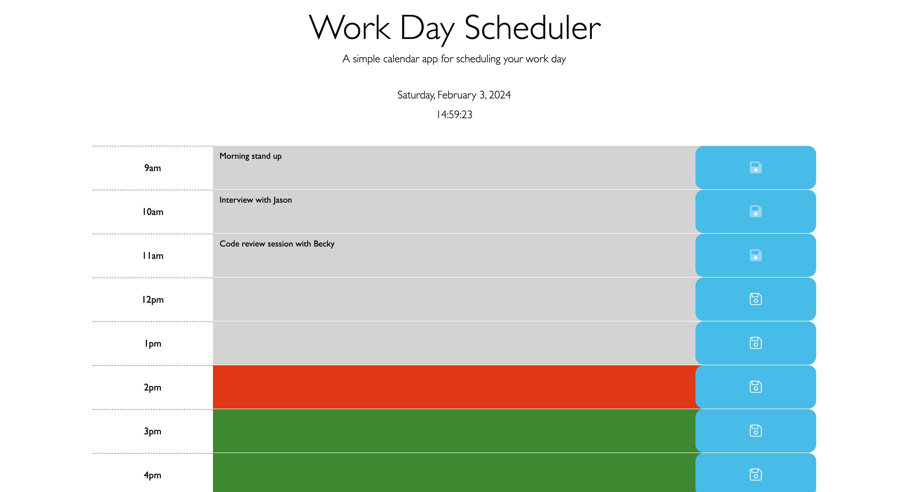

# Work Day Scheduler
## Bootcamp: Module 7 Challenge
The Work Day Scheduler is a simple, intuitive web application designed to help users efficiently plan and manage their workday. Built with HTML, CSS, and JavaScript, it features a user-friendly interface that displays the current day and time, and offers hourly time blocks from 9 AM to 6 PM for scheduling tasks.

## Table of Contents
- [Installation](#installation)
- [Page](#page)
- [Usage](#usage)
- [Credits](#credits)
- [Technology](#technology)
- [License](#license)

## Installation
N/A

## Page
https://adriannaderkacz.github.io/work-day-scheduler/

## Usage
**Planning Your Day**
- **Entering Tasks:** Click on the text area within any hourly blo3ck to type in your tasks or notes for that hour.
- **Saving Tasks:** After typing your task, click the floppy disk icon on the right side of the block to save your task. The icon will change to indicate the saved status.
- **Visual Indicators:** Each time block is color-coded to reflect whether the hour is in the past (gray), present (red), or future (green), helping you to easily identify the current time.
- **Persistent Storage:** Your tasks are saved to the browser's localStorage, meaning they will remain available even after closing and reopening the browser or refreshing the page.
- **Unsaving and Clearing Tasks:** If you decide to unsave a task by clicking again on the save icon, the task will be removed from localStorage, and the text area will be cleared when the page is reloaded.

**Managing Tasks**
- **Editing Tasks:** To edit a saved task, simply click back into the text area of the respective time block, make your changes, and click the save icon again.
- **Viewing Saved Tasks:** Upon opening or refreshing the scheduler, all previously saved tasks will be displayed in their respective time blocks, allowing for easy review and management of your day's plans.

## Credits
I utilized the resources from the following websites to successfully complete this challenge:
- https://www.w3schools.com/
- https://developer.mozilla.org/en-US/
- https://javascript.info/

## Technology
**Technologies Used**
- **HTML5, CSS3, and JavaScript** for the core application structure and functionality.
- **jQuery** for simplified DOM manipulation and event handling.
- **Day.js** for handling date and time operations.
- **Bootstrap 5** for styling and responsive design.
- **Font Awesome** for icons used across the scheduler for a polished, intuitive user interface.

## License
MIT License

Copyright (c) [2024] [AdriannaDerkacz]

Permission is hereby granted, free of charge, to any person obtaining a copy
of this software and associated documentation files (the "Software"), to deal in the Software without restriction, including without limitation the rights to use, copy, modify, merge, publish, distribute, sublicense, and/or sell copies of the Software, and to permit persons to whom the Software is
furnished to do so, subject to the following conditions:

The above copyright notice and this permission notice shall be included in all copies or substantial portions of the Software.

THE SOFTWARE IS PROVIDED "AS IS", WITHOUT WARRANTY OF ANY KIND, EXPRESS OR
IMPLIED, INCLUDING BUT NOT LIMITED TO THE WARRANTIES OF MERCHANTABILITY,
FITNESS FOR A PARTICULAR PURPOSE AND NONINFRINGEMENT. IN NO EVENT SHALL THE
AUTHORS OR COPYRIGHT HOLDERS BE LIABLE FOR ANY CLAIM, DAMAGES OR OTHER
LIABILITY, WHETHER IN AN ACTION OF CONTRACT, TORT OR OTHERWISE, ARISING FROM, OUT OF OR IN CONNECTION WITH THE SOFTWARE OR THE USE OR OTHER DEALINGS IN THE SOFTWARE.